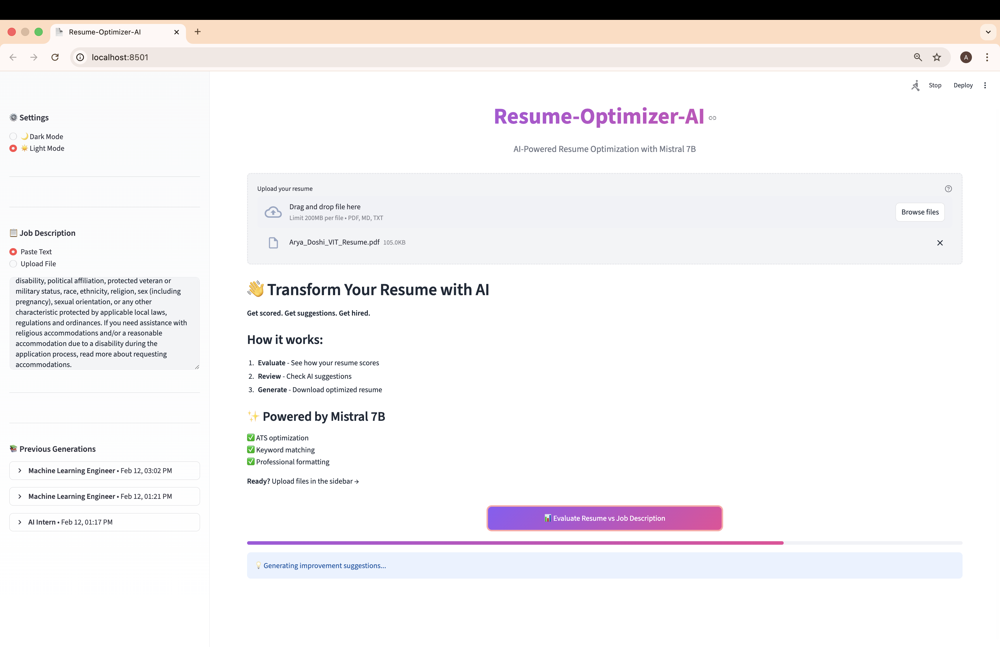
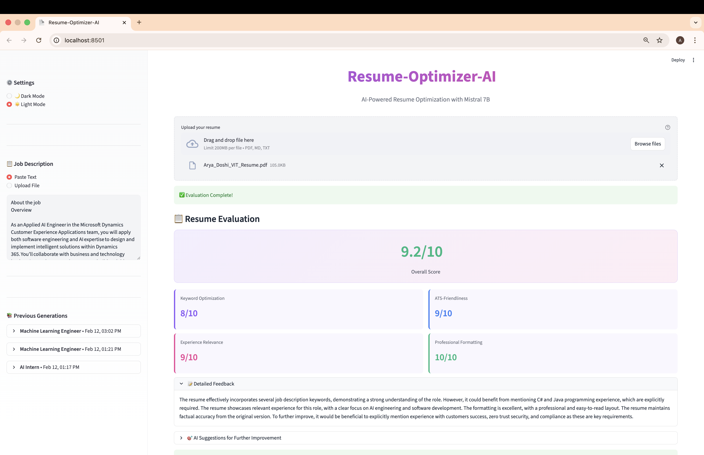
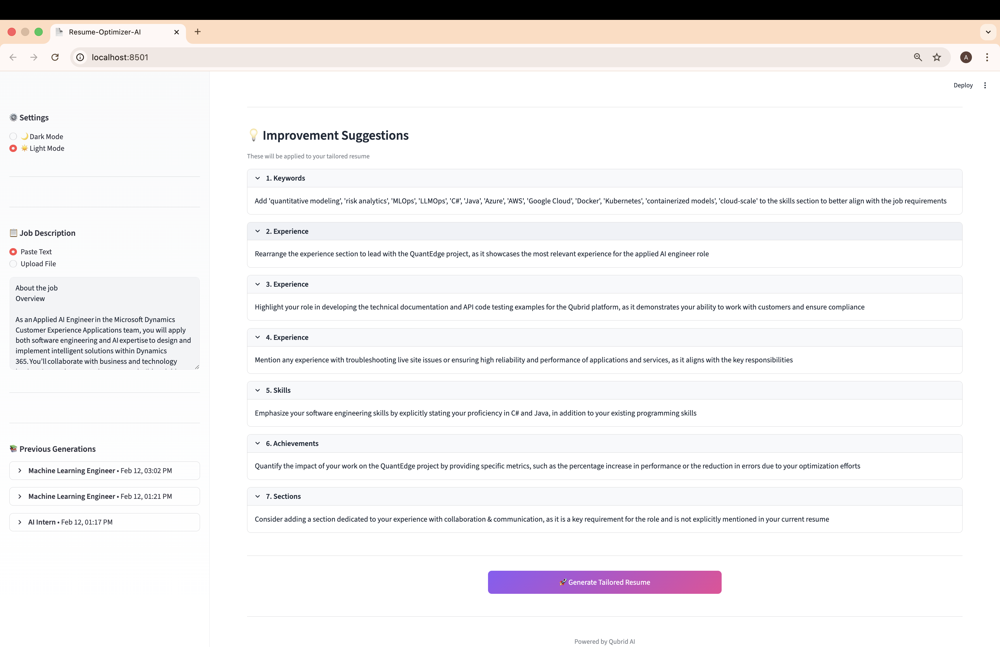
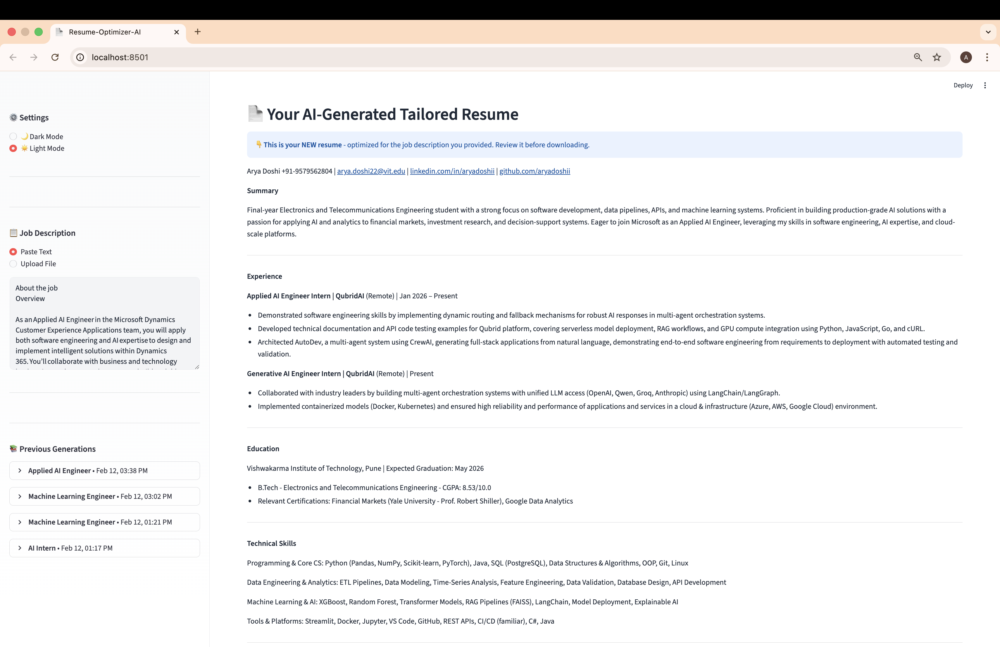
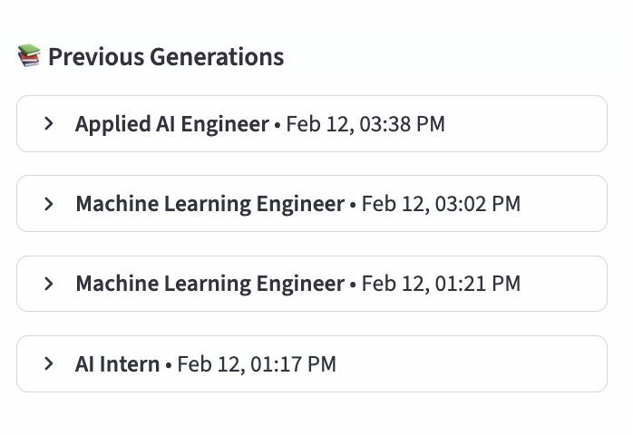
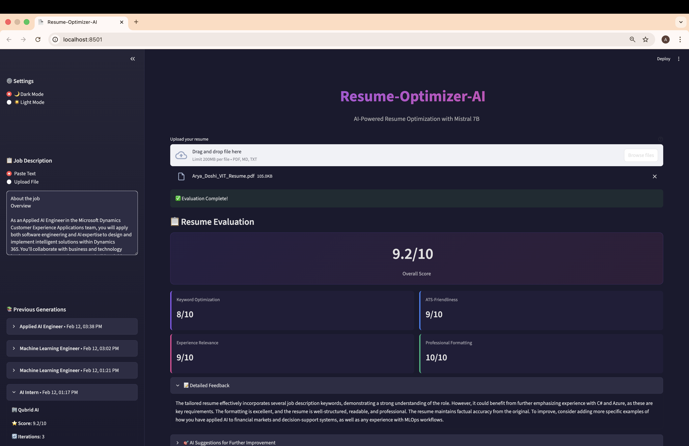

# Resume-Optimizer-AI 🚀

> Transform your resume with AI. Get scored, receive personalized suggestions, and generate ATS-optimized resumes tailored to any job.

[](https://www.python.org/downloads/)
[](https://streamlit.io/)
[](LICENSE)

---

## 📸 UI Screenshots

### 🎯 Upload & Evaluate


*Upload your resume and job description, then get instant AI-powered evaluation with progress tracking.*

---

### 📊 AI Scoring Dashboard


*Receive detailed scores across 4 key metrics: Keyword Optimization, Experience Relevance, ATS-Friendliness, and Professional Formatting.*

---

### 💡 Personalized Suggestions


*Get actionable, job-specific recommendations organized by category—review before generating your optimized resume.*

---

### 📄 Optimized Resume Preview


*Preview your AI-tailored resume with all suggestions applied, ready to download as Markdown or PDF.*

---

### 📚 History & Restore


*Access all past resume generations with scores and iteration counts. Click any chat to restore and review.*

---

### 🌓 Dark Mode Support


*Beautiful dark and light themes with full accessibility and professional color-coded scoring.*

---


## 🏗️ System Architecture


*Resume-Optimizer-AI follows a streamlined 5-stage pipeline with persistent storage, ensuring every resume generation is tracked and restorable.*

---

## ✨ Features

- **📊 Instant AI Scoring** - Get 0-10 scores across keyword optimization, ATS compatibility, experience relevance, and formatting
- **💡 Smart Suggestions** - Receive personalized, actionable recommendations before any changes are made
- **🎯 Job-Specific Tailoring** - AI rewrites your resume to match job requirements perfectly
- **📥 Multiple Formats** - Download as Markdown or professional PDF
- **📚 Complete History** - Track and restore all previous resume optimizations
- **🌓 Modern UI** - Sleek dark/light themes with intuitive design
- **⚡ Lightning Fast** - Powered by Mistral 7B via Qubrid API

---

## 🎯 How It Works

1. **Upload** → Add your resume (PDF/Markdown) and job description
2. **Evaluate** → Get instant AI scoring across 4 key metrics
3. **Review** → See personalized improvement suggestions
4. **Generate** → Create your optimized, ATS-friendly resume
5. **Download** → Export as Markdown or PDF

---

## 📊 Scoring Criteria

Your resume is evaluated on:
- **Keyword Optimization** - Job description alignment
- **Experience Relevance** - Skills & role match
- **ATS-Friendliness** - Applicant Tracking System compatibility
- **Professional Formatting** - Structure & readability

Each scored 0-10, averaged for overall score.

---

## 📁 Project Structure

```
resume-optimizer-ai/
├── backend/
│   ├── __init__.py           # Package marker
│   ├── nodes.py              # AI processing functions
│   ├── prompts.py            # AI prompt templates
│   ├── graph.py              # LangGraph workflow
│   ├── database.py           # SQLite operations
│   ├── utils.py              # File processing
│   └── state.py              # Data structure
├── frontend/
│   ├── assets/               # Images, logos
│   │   └── qubrid_logo.png   # Qubrid logo
│   ├── app.py                # Main Streamlit app
│   ├── components.py         # UI components
│   └── styles.py             # CSS themes
├── data/
│   ├── inputs/               # Temporary uploads
│   ├── outputs/              # Generated resumes
│   └── career_sync.db        # SQLite database
├── .env.example              # API key template
├── .gitignore                # Git exclusions
├── pyproject.toml            # Dependencies (single source of truth)
├── test_api.py               # API testing script
└── README.md                 # This file
```

---

## 🛠️ Tech Stack

- **AI**: Mistral 7B via [Qubrid API](https://platform.qubrid.com)
- **Workflow**: LangGraph for orchestration
- **UI**: Streamlit with custom themes
- **Storage**: SQLite for history
- **Processing**: PyPDF2, WeasyPrint, Markdown

---

## 🎯 Use Cases

✅ **Job Seekers** - Tailor resumes for each application  
✅ **Career Coaches** - Help clients with AI insights  
✅ **Recruiters** - Improve candidate resumes  
✅ **Students** - Build professional resumes  

---

## 🚀 Quick Start

### Prerequisites

- Python 3.12+
- [Qubrid API key](https://platform.qubrid.com)
- UV package manager (recommended)

### Installation

```bash
# 1. Clone repository
git clone https://github.com/aryadoshii/resume-optimizer-ai.git
cd resume-optimizer-ai

# 2. Install UV package manager
curl -LsSf https://astral.sh/uv/install.sh | sh

# 3. Install dependencies
uv pip install -e .

# 4. Set up API key
cp .env.example .env
nano .env  # Add your QUBRID_API_KEY

# 5. (macOS only) Install PDF dependencies
brew install cairo pango gdk-pixbuf libffi gobject-introspection

# 6. Run the app
uv run streamlit run frontend/app.py
```

---

**Made with ❤️ by Qubrid AI**
